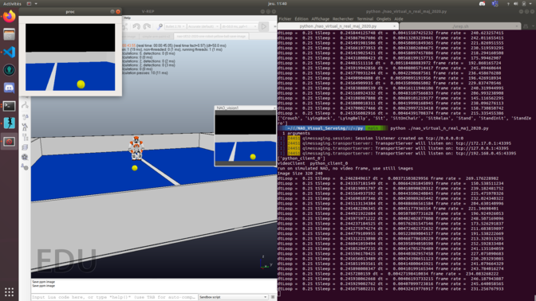
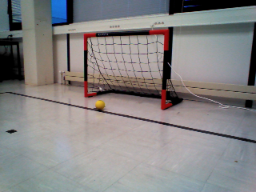

# NAO Visual Servoing

## Introduction

This repository is a school project to introduce visual servoing in robotics. The goal is to control a NAO robot using his camera and some image processing in python3. Then the robot will be able to play football using a ball detection algorithm.

## :barber: Tracker :barber:
Here is a tracker for each task we have to do.

| Task                            | Progression      |
| --------------------------------|:----------------:|
| Ball detection                  |:heavy_check_mark:|
| Read and show NAO images        |:heavy_check_mark:|
| Realtime detection              |:heavy_check_mark:|
| Head heading control            |:heavy_check_mark:|
| Ratio distance pixel estimating |:heavy_check_mark:|
| Shooting the ball               |:heavy_check_mark:|

| Bonus                           | Progression      |
| --------------------------------|:----------------:|
| Rotating around the ball        |:heavy_check_mark:|
| Cage detection                  |:heavy_check_mark:|
| Final shoot                     |:x:               |

## Ball detection

The script *visual_servoing.py* provide a ball tracker class which let us track a yellow ball like a tennis ball in a video stream.


This algorithm detect the center of gravity of the biggest circular yellow object in the HSV color space of the video stream.

A module has been implemented in order to return if the ball was found in the provided frame, the cooridnates of the center of gravity of this ball, and its radius. The following output was obtained with this module :

```bash
False None None
False None None
True (347, 469) 42.012001037597656
True (346, 470) 40.51244354248047
True (346, 470) 40.51244354248047
True (344, 470) 39.51275634765625
True (344, 470) 39.51275634765625
True (344, 470) 39.51275634765625
True (343, 470) 37.513431549072266
```

Where the output is in the format : *{found : bool, (cx, cy) : tuple (int, int), radius : float}*.

## Realtime NAO images processing

The simulator is fully functionnal and well setup. We are able to simulate the NAO using V-REP of Copelia Robotics, and the captured image of the simulated environment is correctly send to the python script which is now able to show the NAO camera.



## Realtime detection

The realtime detection is just the bind detween the BallTracker module and the simulation of the nao. Th goal of this part is to be able to detect the yellow ball in the captured frame of the nao's camera.

## Head heading control

The goal of our mission is to target the ball with the nao's camera, and to be able to shoot it. To do this task we first need to rotate the nao's head in order to be focus on the yellow ball, and to move it in the center of the captured image. To do so, we used a proportional controller in order to move the head depending on the committed error (the difference between the center of the ball and the center of the image along the x axis).

)

Where :
*  is the new control angle of the nao's head heading
*  is the proportionnal coefficient of the controller
*  is the center of the tracked ball in pixels along the x axis
*  is the center of the image in pixels along the x axis

We could see the result of the ball tracking on the foolowing GIF and the correspondig video file (_videos/visual\_servoing.mp4_) is avilable in this repository :


## Ratio distance pixel estimating

The ration between the distance of the ball from the camera of the nao and its pixel size on the image is


Where :
*  is the focal length of the camera
*  is the conversion factor between the pixel size of the ball and the real size of the ball in meter
*  is the distance between the camera and the ball computed with the height of the camera and the projected distance on the ground with the Pythagore formula
*  is the size in pixel of the ball
*  is the real size of the ball (here 0.09 meters)

Then we are able to create a function available in *estimate_camera_parameters.py* which will download some pictures available [here](https://ensta-bretagne.fr/zerr/filerepo/vsik/nao/) and which will detect the ball and compute the mean of  whith the given distance and de processed ball size in pixels.

We get the following output :

```bash
$ python2 estimate_camera_parameters.py
314.144662044
```

Then with a processed ball size in pixels, we are able to compute the estimated distance between the nao and the ball.

## Shooting the ball

Then to move the nao we just need to use the motionProxy and the moveTo method. The motion is split into three steps :
* Rotation of NAO according to the last angle of the head
* Longitudinal motion of the NAO in the direction of the ball
* Shoot of the ball

The final result is visible on the following GIF and the correspondig video file (_videos/nao.mp4_) is avilable in this repository :


## Rotating around the ball

To rotate around the ball we are stting control in order to have the NAO walking on the 0.5 meter circle around the ball. To rotate on an angle , we need to move the robot along the x-axis and the y-axis as the following equation :

* ))
* )

Where R is the radius of the circle (here 0.5 meter). We get the following result :


## Cage detection

A cage tracking image processing chain has been coded in order to detect if the cage is in the vision field of the robot. THe following results are available and we could determine when the cage and the ball are aligned with the robot.

| Original Image             | Tracked Image            |
|:--------------------------:|:------------------------:| 
|||

Note : We use here a real image because in the simulator there is no modelized cage. So to try our algorithm we need to use this kind of image from the real mission.

## Final Shoot

We where not able to do the final shoot becaus the simulated environment don't have any cage. Because the time to modelize a cage with the good colors in order to be detected by our algorithm will take too much time, we were not able to try the final shoot but the code seems to correctly work for every single tasks.

## Authors

* **Quentin Brateau** -  [Teusner](https://github.com/Teusner) :sunglasses:
* **Paul-Antoine Le Tolguenec** - 

## License

This project is licensed under the GNU General Public License v3.0 - see the [LICENSE.md](LICENSE.md) file for details
