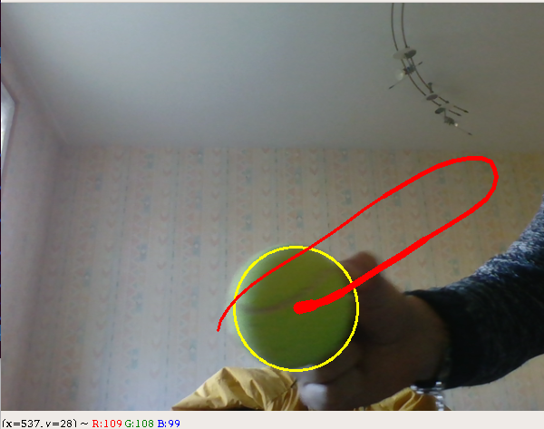

# NAO Visual Servoing

## Introduction

This repository is a school project to introduce visual servoing in robotics. The goal is to control a NAO robot using his camera and some image processing in python3. Then the robot will be able to play football using a ball detection algorithm.

## :barber: Tracker :barber:
Here is a tracker for each task we have to do.

| Task                     | Progression      |
| -------------------------|:----------------:|
| Ball detection           |:heavy_check_mark:|
| Read and show NAO images |:heavy_check_mark:|
| Realtime detection       |:x:               |
| Head heading control     |:x:               |
| Distance control         |:x:               |

## Ball detection

The script *visual_servoing.py* provide a ball tracker class which let us track a yellow ball like a tennis ball in a video stream.



This algorithm detect the center of gravity of the biggest circular yellow object in the HSV color space of the video stream.

A module has been implemented in order to return if the ball was found in the provided frame, the cooridnates of the center of gravity of this ball, and its radius. The following output was obtained with this module :

```bash
False None None
False None None
True (347, 469) 42.012001037597656
True (346, 470) 40.51244354248047
True (346, 470) 40.51244354248047
True (344, 470) 39.51275634765625
True (344, 470) 39.51275634765625
True (344, 470) 39.51275634765625
True (343, 470) 37.513431549072266
```

Where the output is in the format : *{found : bool, (cx, cy) : tuple (int, int), radius : float}*.

## Authors

* **Quentin Brateau** -  [Teusner](https://github.com/Teusner) :sunglasses:
* **Paul-Antoine Le Tolguenec** - 

## License

This project is licensed under the GNU General Public License v3.0 - see the [LICENSE.md](LICENSE.md) file for details
